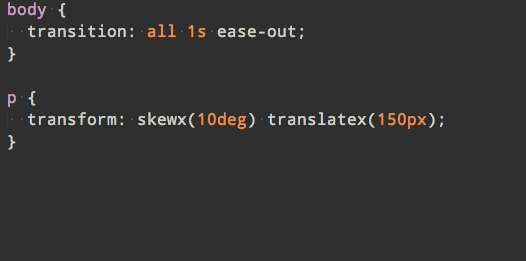

# sublime-autoprefixer

> Sublime plugin to prefix your CSS

You shouldn't have to care about vendor prefixes. Now you don't have too.



Adding prefixes manually is a chore. It's also hard to keep track of where and which prefixes are needed. This plugin uses the [Autoprefixer](https://github.com/ai/autoprefixer) library to prefix properties and values according to the [Can I Use](http://caniuse.com/) database. Which means it will only add the necessary prefixes and not bloat your stylesheet. It even lets you specify what browsers you want to target. In addition it will remove existing prefixes which are no longer needed.

Works only with CSS. Not any preprocessors like Sass or LESS.


## Install

Install `Autoprefixer` with [Package Control](https://sublime.wbond.net) and restart Sublime.

**You need to have [Node.js](http://nodejs.org) installed.**  
Make sure it's in your $PATH by running `node -v` in your command-line.


## Getting started

In a CSS file, open the Command Palette *(Cmd+Shift+P)* and choose `Autoprefix CSS`. You can alternatively create one or more selections before running the command to only prefix those parts.


### Options

*(Preferences > Package Settings > Autoprefixer > Settings - User)*

You can specify which browsers you need to support using an array of rules:

- `last n versions` is last versions for each browser. Like “last 2 versions” [strategy](http://support.google.com/a/bin/answer.py?answer=33864) in Google.
- `> n%` is browser versions, selected by global usage statistics.
- `ff > 20` and `ff >= 20` is Firefox versions newer, that 20.
- `none` don’t set any browsers to clean CSS from any vendor prefixes.
- You can also set browsers directly.


#### Browser names

- `chrome` for Google Chrome.
- `ff` for Mozilla Firefox.
- `safari` for desktop Safari.
- `opera` for Opera.
- `ie` for Internet Explorer.
- `ios` for iOS Safari.
- `android` for old Android stock browser.
- `bb` for Blackberry browser.


#### Default

```json
{
	"browsers": ["last 2 versions"]
}
```


#### Example

```json
{
	"browsers": ["last 1 version", "> 10%", "ie 8", "ie 7"]
}
```

This will add the needed prefixes for the last version of each browser, all browsers with market share of more than 10%, and Internet Explorer 7 and 8.


### Keyboard shortcut

You can also set up a keyboard shortcut to run the command by opening up "Preferences > Key Bindings - User" and adding your shortcut with the `autoprefixer` command.

Example:

```json
[
	{ "keys": ["alt+super+p"], "command": "autoprefixer" }
]
```


### Project settings

You can override the default and user settings for individual projects. Just add an `"Autoprefixer"` object to the `"settings"` object in the project's `.sublime-project` file containing your [project specific settings](http://www.sublimetext.com/docs/3/projects.html).

Example:

```json
{
	"settings": {
		"Autoprefixer": {
			"browsers": ["last 1 version"]
		}
	}
}
```


## License

[MIT](http://opensource.org/licenses/MIT) © [Sindre Sorhus](http://sindresorhus.com)
